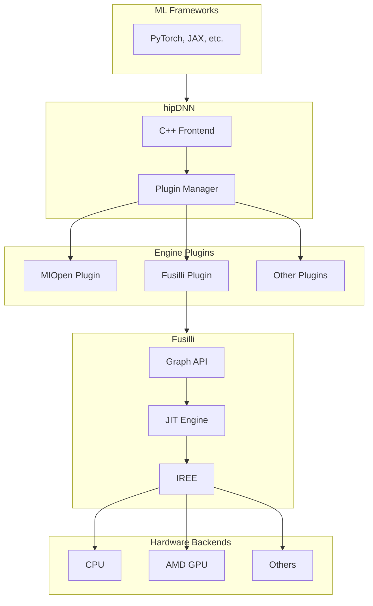

# Introducing Fusilli: A Graph API and JIT Engine Powered by IREE

**Authors:** [Author Names]

Hand-authored GPU kernel libraries have long been the gold standard for high-performance deep learning. Libraries like cuDNN and MIOpen deliver exceptional throughput through meticulously tuned kernels — but this approach comes with inherent trade-offs: scaling to new models, architectures, and hardware targets requires significant engineering effort, and distributing pre-compiled kernels inflates binary sizes and complicates releases.

**[Fusilli](https://github.com/iree-org/fusilli/)** offers a different path. It's a C++ graph API and just-in-time (JIT) compilation engine built on top of [IREE](https://iree.dev) (Intermediate Representation Execution Environment). Rather than shipping pre-built kernels, Fusilli generates optimized code on-the-fly, adapting to the specific workload and target hardware at runtime.

> The name "Fusilli" is inspired by *fusion* — a fundamental compiler optimization that combines multiple operations into single, efficient kernels.


## Why Fusilli?

Traditional kernel libraries face a scalability challenge: every new operation, data type, or hardware target requires hand-tuned implementations. This creates a combinatorial explosion of kernels to write, test, and maintain.

Fusilli takes a compiler-first approach:

| Hand-Authored Kernels | Fusilli (JIT) |
|----------------------|---------------|
| Optimal performance for covered cases | Competitive performance with broader coverage |
| Large binary sizes | Minimal binary footprint |
| Slow iteration on new hardware | Automatic adaptation to new targets |
| Manual fusion patterns | Compiler-driven fusion |

By leveraging IREE's MLIR-based compiler infrastructure, Fusilli benefits from continuous improvements to code generation — optimizations added to IREE automatically flow through to Fusilli users. This creates a flywheel effect: as the compiler improves, all workloads benefit without requiring manual kernel updates.

### Complementing IREE

IREE was designed as an ahead-of-time (AOT) compiler optimized for deploying complete ML models in inference scenarios. It excels at whole-program optimization — analyzing entire computational graphs to produce highly efficient, self-contained artifacts.

Fusilli extends IREE's capabilities along complementary modalities:

| IREE (Traditional) | Fusilli |
|--------------------|---------|
| Ahead-of-time (AOT) compilation | Just-in-time (JIT) compilation |
| Full program optimization | Individual kernel codegen |
| Inference-focused | Training compatible |
| Static deployment artifacts | Dynamic runtime integration |

This makes Fusilli well-suited for scenarios where:

- **Dynamic shapes or parameters** require on-the-fly compilation
- **Training workloads** need gradient computations alongside forward passes
- **Library integration** demands individual operations rather than complete models
- **Rapid iteration** benefits from on-demand compilation without offline build steps

Together, IREE and Fusilli cover the full spectrum — from optimized model deployment to flexible kernel generation.

## Ecosystem and Integration

Fusilli serves as a middleware layer between high level ML frameworks and libraries (PyTorch, hipDNN) and low level ML compiler and runtime libraries (IREE):



### IREE: The Compiler Backbone

IREE is an MLIR-based end-to-end compiler and runtime that lowers ML models to optimized code for diverse hardware backends. Fusilli interfaces with both IREE's compiler and runtime through the C API, providing:

- **Multi-target support**: CPU, AMD GPUs (via HIP), and other backends IREE supports
- **Production-grade runtime**: Lightweight, embeddable execution environment
- **State-of-the-art codegen**: Benefiting from active MLIR/LLVM development

### hipDNN Integration

Fusilli serves as a plugin within [hipDNN](https://github.com/ROCm/rocm-libraries/tree/develop/projects/hipdnn), AMD's graph-based deep learning library. This integration allows frameworks like PyTorch to access Fusilli's JIT-compiled kernels through hipDNN's familiar cuDNN-compatible API. The plugin architecture means Fusilli can be used alongside other kernel providers (like MIOpen) with the best engine selected per operation.

### Backend Extensibility

While Fusilli currently targets CPU and AMD GPUs, its architecture is inherently backend-agnostic. Any target that IREE supports—including NVIDIA GPUs, Vulkan devices, and custom accelerators—can potentially be added without changes to the graph API or frontend code.

## Programming Model

Fusilli exposes a graph-based API inspired by cuDNN's frontend. The workflow follows a clear pattern:

1. **Create a Graph** – Container for the computational graph
2. **Define Tensors** – Specify dimensions, strides, and data types
3. **Add Operations** – Build the graph with matmul, conv, pointwise ops
4. **Validate & Compile** – Check correctness and JIT-compile for the target
5. **Execute** – Run with actual data buffers

### Example: Basic Matrix Multiplication

Here's a minimal example computing `C = A @ B`:

```cpp
#include <fusilli.h>
using namespace fusilli;

// Create a device handle (CPU or AMDGPU)
auto handle = Handle::create(Backend::CPU);

// Build the graph
auto graph = std::make_shared<Graph>();
graph->setName("matmul_example");
graph->setIODataType(DataType::Half).setComputeDataType(DataType::Float);

// Define input tensors
int64_t m = 64, k = 128, n = 256;
auto A = graph->tensor(
    TensorAttr().setName("A").setDim({m, k}).setStride({k, 1}));
auto B = graph->tensor(
    TensorAttr().setName("B").setDim({k, n}).setStride({n, 1}));

// Add matmul operation
auto C = graph->matmul(A, B, MatmulAttr().setName("matmul"));
C->setOutput(true);

// Bind data buffers
std::unordered_map<std::shared_ptr<TensorAttr>, std::shared_ptr<Buffer>> variantPack = {
    {A, aBuf}, {B, bBuf}, {C, cBuf}
};

// Validate, compile, and execute
graph->validate();
graph->compile(handle);
graph->execute(handle, variantPack);
```

### Example: Fused Convolution + Bias + ReLU

Fusilli's strength lies in fusing multiple operations. Here's a forward convolution with bias addition and ReLU activation—all compiled into a single efficient kernel:

```cpp
#include <fusilli.h>
using namespace fusilli;

// Create a device handle (CPU or AMDGPU)
auto handle = Handle::create(Backend::AMDGPU);

auto graph = std::make_shared<Graph>();
graph->setName("conv_bias_relu");
graph->setIODataType(DataType::Half).setComputeDataType(DataType::Float);

// Input image (NHWC layout)
auto X = graph->tensor(TensorAttr()
    .setName("image")
    .setDim({n, c, h, w})
    .setStride({c*h*w, 1, c*w, c}));

// Filter weights (KRSC layout)
auto W = graph->tensor(TensorAttr()
    .setName("filter")
    .setDim({k, c, r, s})
    .setStride({c*r*s, 1, c*s, c}));

// Convolution
auto convResult = graph->convFProp(X, W, ConvFPropAttr()
    .setStride({1, 1})
    .setPadding({0, 0})
    .setDilation({1, 1}));

// Bias addition (broadcasts from {1, k, 1, 1})
auto bias = graph->tensor(TensorAttr()
    .setName("bias")
    .setDim({1, k, 1, 1})
    .setStride({k, 1, k, k}));
auto biasResult = graph->pointwise(convResult, bias,
    PointwiseAttr().setMode(PointwiseAttr::Mode::ADD));

// ReLU activation
auto output = graph->pointwise(biasResult,
    PointwiseAttr().setMode(PointwiseAttr::Mode::RELU_FWD));
output->setOutput(true);

// Bind data buffers
std::unordered_map<std::shared_ptr<TensorAttr>, std::shared_ptr<Buffer>> variantPack = {
    {X, xBuf}, {W, wBuf}, {bias, biasBuf}, {output, outBuf}
};

// Validate, compile, and execute
graph->validate();
graph->compile(handle);
graph->execute(handle, variantPack);
```

The compiler automatically fuses the convolution, bias, and ReLU into an optimized kernel — no manual fusion patterns required.

## Current Capabilities

Fusilli is under active development. Current operation support includes:

| Category | Operations |
|----------|------------|
| **Convolution** | Forward (fprop), data gradient (dgrad), weight gradient (wgrad); grouped convolutions; 2D and 3D |
| **Matrix Multiply** | Basic matmul, batched matmul, transpose and broadcast variants |
| **Pointwise** | ADD, SUB, MUL, DIV, RELU_FWD, and other unary/binary ops |
| **Reduction** | SUM, MIN, MAX among others |

### Supported Backends

- **CPU**: For development, testing, and CPU-bound workloads
- **AMD GPU**: Production deployment on AMD Instinct and Radeon GPUs

## Summary

Fusilli bridges the gap between hand-tuned kernel libraries and compiler-generated code. By building on IREE's robust compiler infrastructure, it offers:

- **Flexibility**: Graph-based API adapts to diverse workloads
- **Portability**: Backend-agnostic design extends to any IREE target
- **Efficiency**: JIT compilation reduces binary sizes and deployment complexity
- **Continuous Improvement**: Compiler advances benefit all users automatically

Whether you're exploring alternatives to traditional kernel libraries or building the next generation of ML infrastructure, Fusilli provides a foundation for high-performance, maintainable deep learning operations.

**Resources:**

- [Fusilli on GitHub](https://github.com/iree-org/fusilli)
- [IREE Project](https://iree.dev)
- [hipDNN Blog](TBD)

---

*Fusilli is developed by AMD engineers and open-source contributors. We welcome feedback, bug reports, and contributions through the GitHub repository.*
